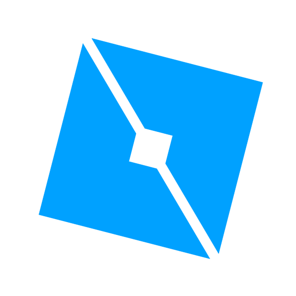
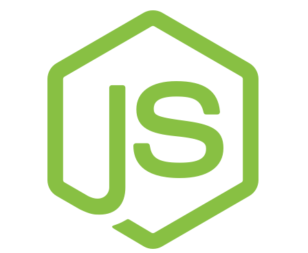
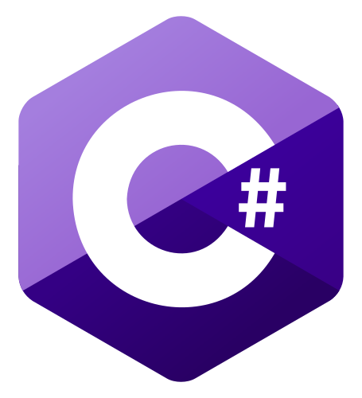
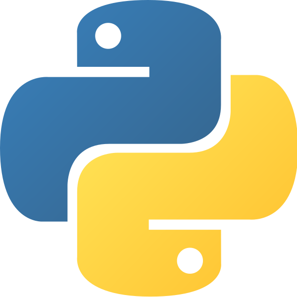

# Hello!
Welcome to my profile, I don't use GitHub too much so there's not too much to see here. 
 
I'll tell you a bit about me while you're here

# My interests
- Game Development (Roblox mostly)
- Web Development (FERN stack)

# My skills

# My Contacts

[(https://devforum.roblox.com/u/returnedtrue)

# My stats

